# Tiling Electronic Structure

Investigating the electronic structure of k-uniform planar tilings.

## Examples

|     |     |     |
|-----|-----|-----|
| 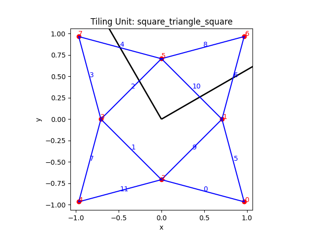 | 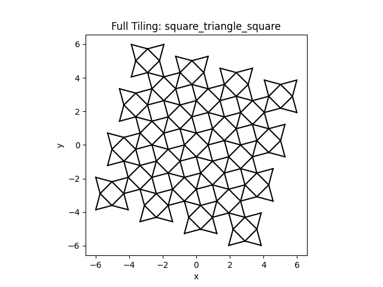 | 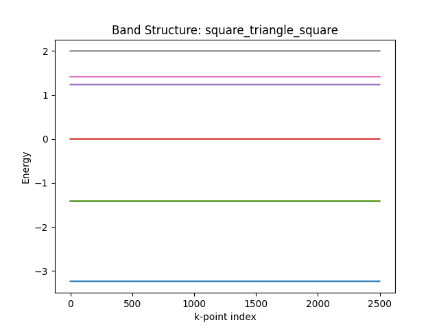 |
| 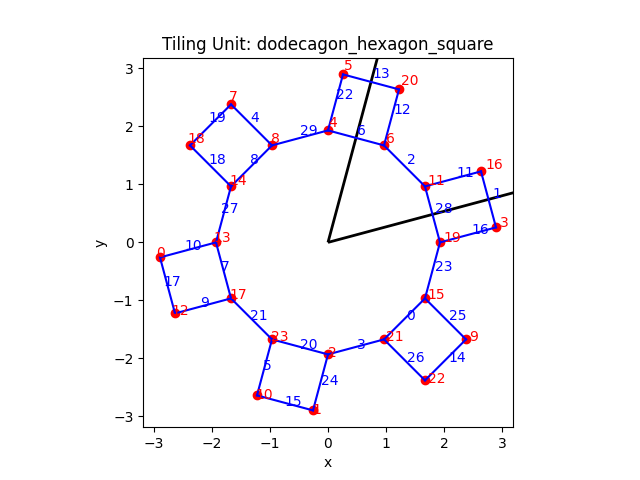 | 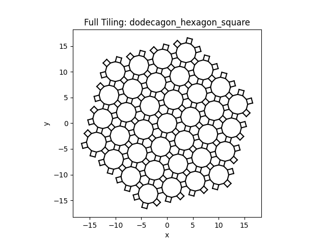 | 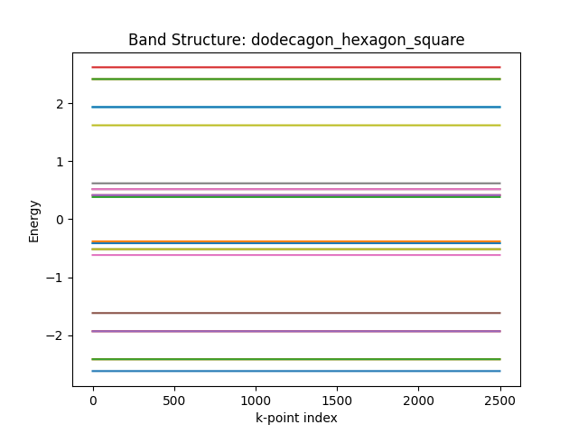 |
|  | 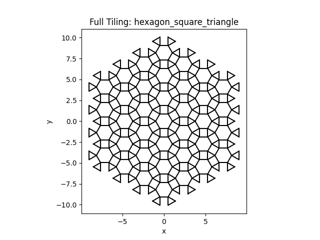 | 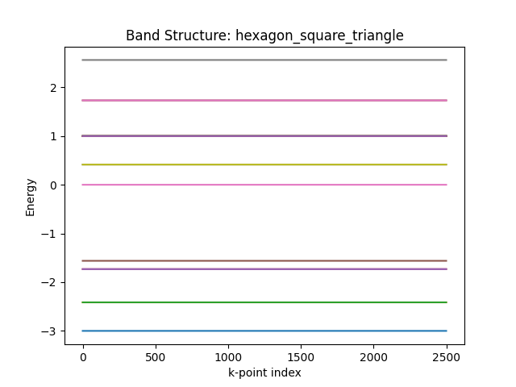 |
| 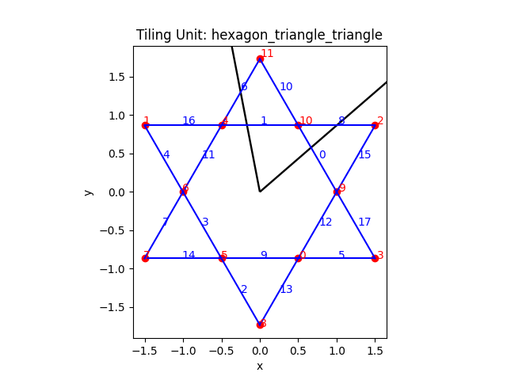 | 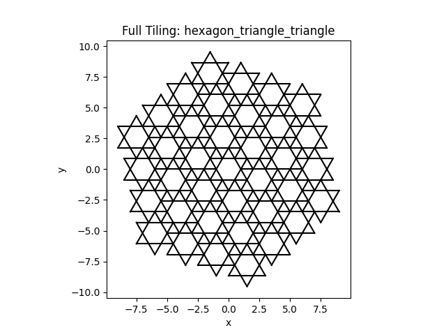 | 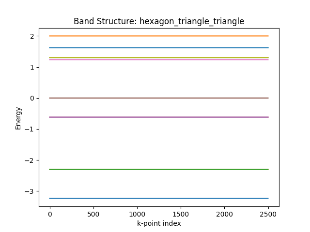 |
| 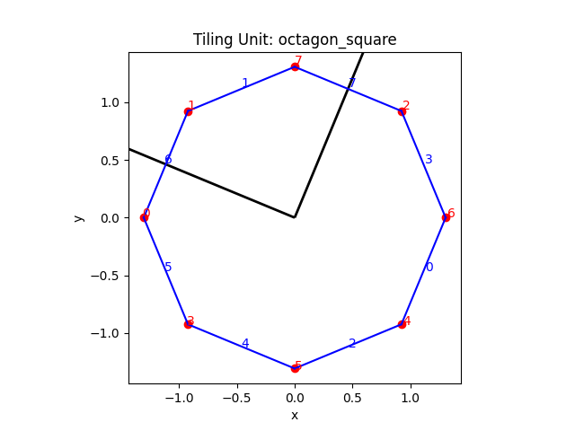 | 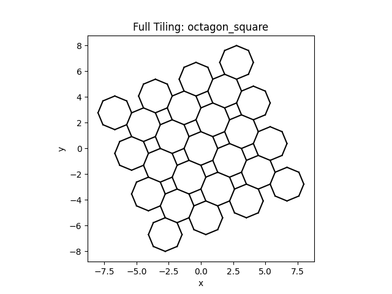 | 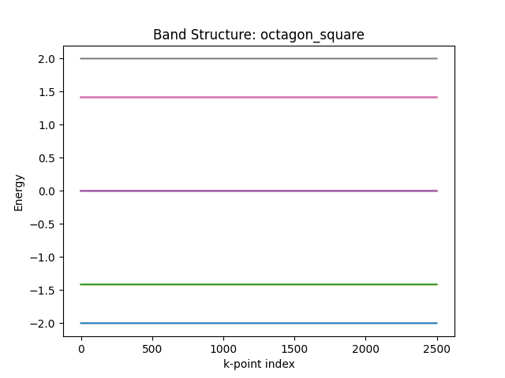 |