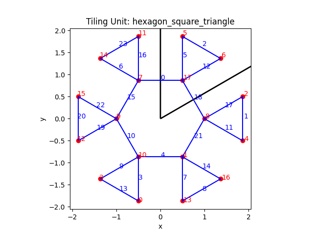

# Tiling Electronic Structure

Investigating the electronic structure of k-uniform planar tilings.

## Examples

|     |     |     |
|-----|-----|-----|
|  |  |  |
|  |  |  |
|  |  |  |
|  |  |  |
|  |  |  |

## Overview: K-Uniform Planar Tilings and Tight-Binding Model Analysis

This project focuses on generating k-uniform planar tilings and analyzing them as atomic lattices. Python is employed to create these tilings, and their electronic properties are investigated using the tight-binding model.

## Key Components

1. **Tiling Generation**: K-uniform planar tilings are generated using Python. These tilings serve as the foundation for the investigation. Each tiling is treated as a lattice composed of atoms, with their connectivity representing atomic bonds.

2. **Tight-Binding Model**: The tight-binding model is utilized to investigate the electronic structure of these tilings. This model is well-suited for understanding the electronic properties of crystals by treating the electrons as bound to specific atomic sites and allowing them to hop between neighboring sites.

3. **Band Structure Analysis**: The electronic band structure of different tilings is explored using the tight-binding model. The tilings are composed of various species of atoms, and the effects of changing these atomic types on the resulting electronic properties are studied.

## Files in This Repository

- **vec.py**: This file contains a 2D vector class with utility functions for vector operations, which are essential for handling geometric calculations in tiling generation and analysis.
- **uniform_tilings_1.py**: This file defines unit pattern generators for various 1-uniform tilings, providing functions to create specific tiling patterns using geometric shapes.
- **tiling.py**: This file provides classes and methods to represent and manipulate tilings as collections of shapes, including functionality for rendering and analyzing the tilings.
- **tight_binding.py**: This file implements the tight-binding model to compute the electronic band structure for the generated tilings, including functions to create and visualize the model.
- **Pipfile**: Defines the dependencies required for this project.

## Getting Started

### Prerequisites

Ensure that [Python 3.x](https://www.python.org/downloads/) is installed. The dependencies for the project can be found in the `Pipfile`. Use [Pipenv](https://pipenv.pypa.io/en/latest/) to manage these dependencies.

### Installation

1. **Install Pipenv**: If Pipenv is not already installed, it can be added using pip:

   ```bash
   pip install pipenv
   ```

2. **Install Dependencies**: Navigate to the project directory and run the following command to install the required dependencies:

   ```bash
   pipenv install
   ```

   This will install all the necessary dependencies listed in the `Pipfile`, including:
   - pythtb
   - matplotlib

3. **Activate the Pipenv Shell**: To start a Pipenv shell, which ensures the environment is correctly set up, use:

   ```bash
   pipenv shell
   ```

This setup will ensure that all necessary packages are installed and the environment is ready for development or execution of the project scripts.

## Running the Scripts

The project includes several Python modules that can be executed as standalone scripts to visualize and analyze different tiling patterns and their electronic structures.

### Running `uniform_tilings_1.py`

This script generates and displays various 1-uniform tiling patterns. To run the script, use the following command:

```bash
python uniform_tilings_1.py
```

This will render each tiling unit and its full tiling pattern using matplotlib.

### Running `tight_binding.py`

This script demonstrates the creation of a tight-binding model from a tiling pattern and plots its band structure. To execute the script, use:

```bash
python tight_binding.py
```

By default, this script uses the `hexagon_square_triangle` tiling pattern. It will render the tiling unit, the full tiling, and visualize the band structure using matplotlib.

Ensure that you have all the necessary dependencies installed and the environment set up as described in the "Getting Started" section before running these scripts.
